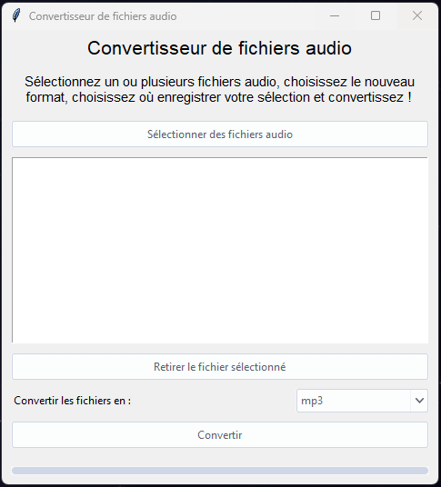

# Audio Converter 🎵

## Overview

Audio Converter is a simple, user-friendly application that allows you to convert audio files from one format to another. The application supports multiple audio formats including MP3, WAV, AIFF, FLAC, and OGG.

## Features 🔥

- **File selection** 📁: Easily select multiple files for conversion.
- **Format selection** 🔄: Choose the desired output format from a drop-down list.
- **Progress tracking** 📊: Track the progress of your conversions with a progress bar.
- **Error handling** 🚫: The application provides helpful error messages if something goes wrong.

## Usage 💻

1. **Select Files** 📂: Click the "Select Files" button to choose the audio files you want to convert. You can select multiple files at once.
2. **Choose Format** 🔄: Choose the output format from the drop-down list.
3. **Convert** 🎧: Click the "Convert" button to start the conversion. The progress bar will indicate the progress of the conversion.
4. **Delete File** 🗑️: If you want to remove any file from the list, select it and click the "Delete File" button.

## Requirements ⚙️

The application requires FFmpeg to perform audio conversions. Please make sure FFmpeg is installed on your system and properly set in the PATH before using Audio Converter.

## Installation 📦

The application is distributed as a standalone executable file. No installation is required — simply download the file and run it on your machine.
